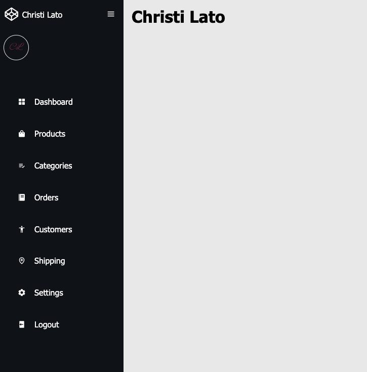
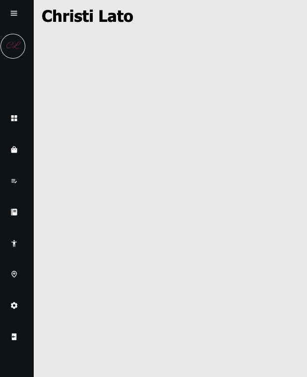

# Responsive-Sidebar-Menu

A beginner follow along tutorial building a responsive sidebar menu in HTML, CSS, &amp; Javascript

## Follow Along Thoughts

I find follow along videos great for showing me the proper way to code and the proper way to think about the solutions. It really clarifies that starting, mid and endo points of the project. After doing follow along videos, I feel even more confident in my skills.

This project was made with HTML & CSS only. Previously, I would have still created a js file, even if there were a few lines of code. Watching Clint on this project has opened my eyes on what files and things are actually necessary.

This project helped me understand the starting points & how to go about it. How many containers are we envisioning to how many divs inside of each container, were the first talking points before beginning.

The CSS on the project helps me understand all the elements and how they can be styled. As I would follow along, I would go line by line and make sure to understand what styling was responsible for what. This will only help me grow in my CSS skills.

New Things Learned:

1. Using touch in terminal to create multiple files at once
2. Boxicons.icom for High QUality Web Icons- usage we imported as css link rahter than a package or manually in the scripts. The documentation shows how to do all of the import options.
3. Active & hovering CSS elements were heaily focused.

## Follow Along Credit

I followed along with Clint Briley, who owns the youtube channel CodeCommerce.

I really enjoy folllowing along to Clint. His pace and his explanations are clearly stated & make it easy to follow along, while learning so much!

https://www.youtube.com/watch?v=uy1tgKOnPB0&t=1486s

### Screenshot of Project

